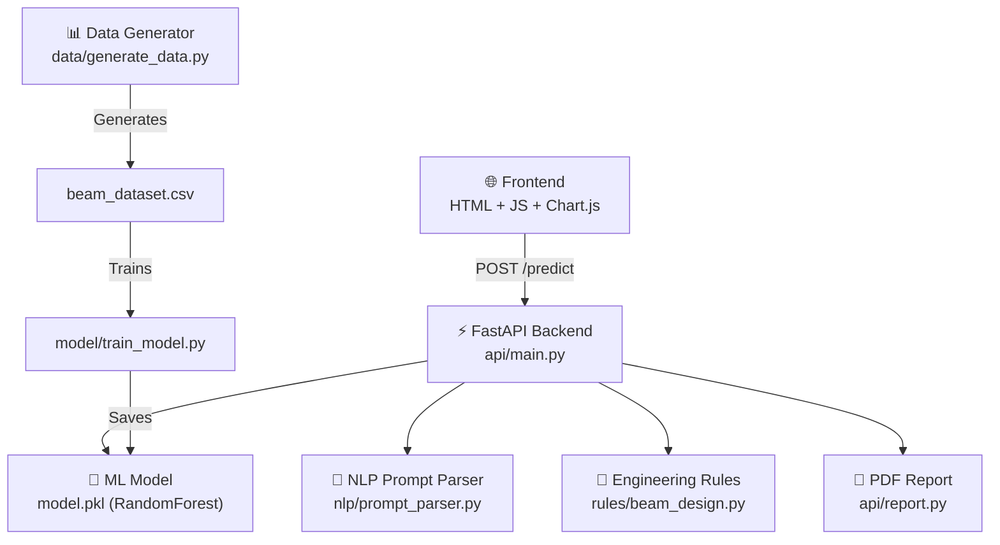

# 🔍 AI Structural Design System — Code Review & Bug Report

## 📖 What I Understand About Your Project

This is a **Final Year Project** — an **AI-powered structural beam design system** built by the MEEK Technology team (David, Nurudeen, Waliy & Abbas), supervised by Dr. H. I. Adebakin.

### Architecture Overview

### How it works:
1. **User enters a prompt** like *"Design a beam with span 6m, load 25kN/m, grade 30 concrete and steel grade 500"*
2. **NLP parser** extracts structural parameters (span, load, fck/fcu, fy, wall properties, support type)
3. **ML model** (scikit-learn RandomForestRegressor) predicts the required steel area
4. **Engineering rules** calculate bending moment, recommend reinforcement bars, estimate beam size, and check deflection
5. **Frontend** displays results + shear/moment/load diagrams via Chart.js + a beam visualization on canvas
6. **PDF report** can be downloaded with all the results

---

## 🐛 Bugs & Errors Found

### 🔴 CRITICAL — Will Crash the App

| # | File | Issue | Details |
|---|------|-------|---------|
| 1 | [prompt_parser.py](file:///c:/MeekTechWorld/Projects/AI-Structural-Design/nlp/prompt_parser.py#L1) | **Unused/wrong import: `from marshal import load`** | The `marshal.load` is never used. This is dead code but also confusing. |
| 2 | [prompt_parser.py](file:///c:/MeekTechWorld/Projects/AI-Structural-Design/nlp/prompt_parser.py#L4) | **Unused/wrong import: `from fastapi import params`** | `params` is never used in this file. This import also makes the NLP module depend on FastAPI unnecessarily — it will fail if you ever try to use `prompt_parser.py` outside a FastAPI-installed environment. |
| 3 | [main.py (api)](file:///c:/MeekTechWorld/Projects/AI-Structural-Design/api/main.py#L59) | **`check_deflection` called TWICE — first call will crash** | Line 59 calls `check_deflection(span, beam_size["depth"])` with only 2 args. But the function signature is `check_deflection(span, depth, support_type="simply_supported")`. This first call works because of the default... but **it's wasted work** — line 62 immediately overwrites `deflection_status` with the correct 3-argument call. |
| 4 | [main.py (api)](file:///c:/MeekTechWorld/Projects/AI-Structural-Design/api/main.py#L31) | **KeyError when using direct params (no prompt)** | When `data` is sent without `"prompt"`, `params = data` is used directly. If the user sends `"fck"` but not `"fcu"`, line 31 will crash: `params["fcu"] if "fcu" in params else params["fck"]`. This doesn't handle the case where **neither** key exists. |
| 5 | [main.py (api)](file:///c:/MeekTechWorld/Projects/AI-Structural-Design/api/main.py#L61) | **`apply_defaults` drops the `support` key** | `apply_defaults()` only returns `span, load, fcu, fy, wall_height, wall_thickness, density`. It does NOT pass through the `support` key. So `params.get("support", "simply_supported")` on line 61 will **always** default to `"simply_supported"` even if the user said "cantilever". |
| 6 | [main.py (api)](file:///c:/MeekTechWorld/Projects/AI-Structural-Design/api/main.py#L29-L30) | **No null-check on span/load** | If the NLP fails to extract `span` or `load` (returns `None`), line 29-30 will assign `None` and all downstream math will crash with `TypeError`. |
| 7 | [main.py (root)](file:///c:/MeekTechWorld/Projects/AI-Structural-Design/main.py) | **Root `main.py` is empty** | This file is blank — it does nothing. |

### 🟡 MODERATE — Logical/Behavioral Bugs

| # | File | Issue | Details |
|---|------|-------|---------|
| 8 | [prompt_parser.py](file:///c:/MeekTechWorld/Projects/AI-Structural-Design/nlp/prompt_parser.py#L9-L10) | **Span regex too greedy — captures ANY number followed by "m"** | The regex `(\d+\.?\d*)\s*m` will match "500 MPa" and extract "500" as the span if the span pattern fails first and falls through. The `or` fallback then won't be checked. |
| 9 | [prompt_parser.py](file:///c:/MeekTechWorld/Projects/AI-Structural-Design/nlp/prompt_parser.py#L29) | **Support type parsed with spaces but used with underscores** | The regex captures `"simply supported"` (with a space) but downstream code checks for `"simply_supported"` (with underscore). The support value will never match, causing it to fall into the `else` default branch silently. |
| 10 | [beam_design.py](file:///c:/MeekTechWorld/Projects/AI-Structural-Design/rules/beam_design.py#L80) | **`recommend_reinforcement` "best" picks smallest area — WRONG** | `min(solutions, key=lambda x: x["provided_area"])` picks the option with the *least* provided steel — which is just the smallest bar (10mm). The correct logic should find the option with the **least excess** while still meeting the requirement: `min([s for s in solutions if s["provided_area"] >= As_required], key=lambda x: x["provided_area"])`. |
| 11 | [data/generate_data.py](file:///c:/MeekTechWorld/Projects/AI-Structural-Design/data/generate_data.py#L14) | **`fck` is generated but NEVER used in `design_beam()`** | `design_beam(load, span, fy=fy)` doesn't use `fck` at all, but `fck` is saved in the dataset. The model trains on `fck` as an input feature, but the target (`steel_area`) is completely independent of `fck`. This means **the model is learning a meaningless relationship** for the `fck` feature. |
| 12 | [report.py](file:///c:/MeekTechWorld/Projects/AI-Structural-Design/api/report.py#L15) | **Report accesses `data['input']['fcu']` — may crash** | If the direct-params path was used and the key is `fck` not `fcu`, this will KeyError. |

### 🟢 MINOR — Code Quality / Cleanup

| # | File | Issue |
|---|------|-------|
| 13 | [script.js](file:///c:/MeekTechWorld/Projects/AI-Structural-Design/api/static/script.js#L24) | Duplicated `console.log` on line 24: `console.log("Response:", data); console.log("Response:", data);` |
| 14 | [script.js](file:///c:/MeekTechWorld/Projects/AI-Structural-Design/api/static/script.js#L48-L49) | Two separate `alert()` calls in the error handler — annoying UX. Combine into one. |
| 15 | [main.py](file:///c:/MeekTechWorld/Projects/AI-Structural-Design/api/main.py#L14) | Dead commented-out code: `# manual_As = calc_steel_area(moment)` |
| 16 | [main.py](file:///c:/MeekTechWorld/Projects/AI-Structural-Design/api/main.py#L59) | Redundant first call to `check_deflection` (result is immediately overwritten). |
| 17 | Project-wide | No `__init__.py` files in `nlp/`, `api/`, `rules/`, `data/`, `model/` — may cause import issues depending on Python version. |
| 18 | [style.css](file:///c:/MeekTechWorld/Projects/AI-Structural-Design/api/static/style.css#L81-L87) | Duplicate `button` style block (lines 43-53 and 81-87). |

---

## 🔧 Summary of Fixes Needed

The most impactful bugs to fix right now are:

1. **Remove bad imports** in `prompt_parser.py` (lines 1 and 4)
2. **Fix `apply_defaults` to preserve the `support` key** — this is why support type is broken
3. **Fix the support type regex** to replace spaces with underscores (`"simply supported"` → `"simply_supported"`)
4. **Remove the redundant first `check_deflection` call** in `main.py`
5. **Fix `recommend_reinforcement`** to actually find the best option that meets the requirement
6. **Add null-checks** for `span` and `load` after NLP extraction
7. **Add `__init__.py`** files to all package directories
