# Chapter Four - Implementation & Results

## 4.1 Beam Design Implementation

The beam design module was developed using Python functions to compute structural parameters.

    
     
    <em>Figure 4.1a: Beam design testing result</em>

<!--  -->
 
The bending moment for a simply supported beam under uniformly distributed load was calculated using the formula:

Mu = wL² / 8

Where:

- w = load (kN/m)
- L = span (m)

The required steel area was computed using standard reinforcement concrete design equations.

    
     
    <em>Figure 4.1b: Beam design testing code</em>

## 4.2 Dataset Generation

A dataset was generated using simulated structural parameters to train the AI model.

    
         
        <em>Figure 4.2a: Dataset generation script</em>

    
     
    <em>Figure 4.2b: Dataset generation terminal print</em>

The parameters included:

- Beam span (3m – 10m)
- Load (10 kN/m – 50 kN/m)
- fck (concrete grade 20, 25, 30)
- fy (steel grade 460)

For each generated input, the corresponding steel area was calculated using the standard beam design equations.

A total of 5000 data samples were generated and stored in a CSV file for training purposes.

    
    
     
    <em>Figure 4.2c & 4.2d: Generated data samples in csv</em>

## 4.3 AI Model Development

A machine learning model was developed to predict the required steel area for beam design based on input parameters.

    
     
    <em>Figure 4.3a: AI model development script</em>

The dataset generated was used to train the model, with the following features:

- Span
- Load
- fck
- fy

The target output was:

- Steel area

A Random Forest Regression algorithm was used for training due to its ability to handle nonlinear relationships and provide accurate predictions.

    
     
    <em>Figure 4.3b: trained AI model</em>

The trained model was saved as "model.pkl" and used for making predictions within the system.

The result output from the model was compared with the calculated steel area from the beam design module to evaluate the accuracy of predictions.

    
     
    <em>Figure 4.3c: AI generated Steel Area result</em>

## 4.4 Model Input Features

The AI model was trained using four input features:

- Span
- Load
- Concrete strength/grade (fcu/fck)
- Steel strength/grade (fy)

These parameters were used to improve the accuracy of predictions and better reflect real-world structural design conditions.

The inclusion of both concrete and steel grades allowed the model to learn the influence of material properties on the required steel area for beam design.

    
     
    <em>Figure 4.4a: Model input features</em>

## 4.5 Prompt-Based Input System

A prompt-based input system was developed to allow users to input structural parameters using natural language.

The system extracts key parameters such as:

- Span
- Load
- Concrete strength/grade (fcu/fck)
- Steel strength/grade (fy)

    
     
    <em>Figure 4.5a: Natural language parameters extracter</em>

    
     
    <em>Figure 4.5b: Prompt to parameters testing</em>

Pattern matching techniques using regular expressions were used to identify and extract values from user input.

Default values were applied for missing parameters to ensure reliable system performance.

## 4.6 System Integration and API Development

A backend API was developed to integrate the AI model, engineering calculations, and prompt-based input system.

The API was implemented using FastAPI and allows users to send input data either manually or as a natural language prompt.

    
    
     
    <em>Figure 4.6a & 4.6b: Testing the API using natural language prompts</em>

The system processes the input, performs AI-based prediction, computes structural parameters, and returns the results in a structured format.

## 4.7 Flexible Prompt Interpretation     *

The system was enhanced to support flexible natural language input by allowing multiple representations of structural parameters.

For example:

Concrete strength can be entered as “fcu”, “fck”, “concrete grade”, or “grade of concrete”
Steel strength can be entered as “fy”, “steel grade”, or “grade of steel”

The system also supports different positional formats such as:

“6m span”
“span 6m”

This improves usability and allows the system to better interpret human language inputs.

    
     
    <em>Figure 4.7a: Flexible Prompt Interpretation</em>

## 4.8 Enhanced API Integration      *

The API was enhanced to support flexible user input by integrating an improved prompt parsing system.

The system allows different representations of structural parameters such as:

“fcu”, “fck”, and “concrete grade” for concrete strength
“fy”, “steel grade”, and “MPa” for steel strength

To maintain compatibility with the trained AI model, the extracted concrete strength (fcu) was internally mapped to fck before prediction.

This approach ensures both flexibility in user input and consistency in model performance.

## 4.9 Frontend Development

A user interface was developed using HTML, CSS, and JavaScript to allow interaction with the system.

The interface allows users to input design prompts and view computed structural results.

The frontend communicates with the backend API using HTTP requests and displays the results dynamically.

    
     
    <em>Figure 4.9a: Frontend interface</em>

## 4.10 Graphical Visualization

Graphical representations of structural behavior were implemented to enhance system output.

Shear Force and Bending Moment diagrams were generated by computing values along the beam span and visualizing them using a charting library.

This allows users to better understand structural performance visually.

    <a href="images/Screenshot_2090.png">
        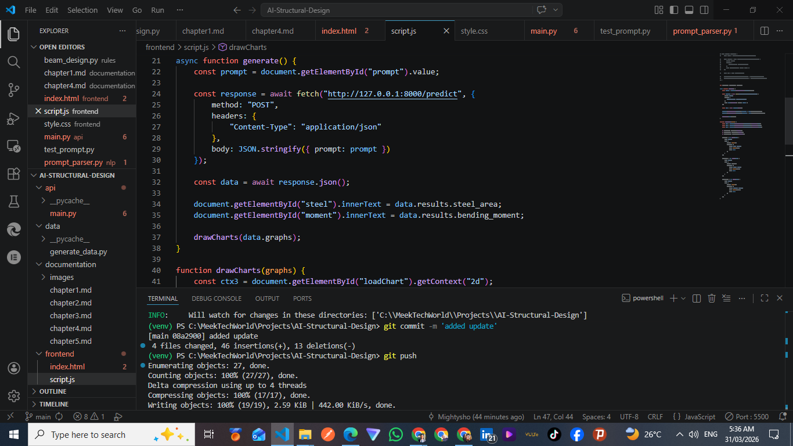
    </a>
     
    <em>Figure 4.10a: Graphical visualization of shear and moment diagrams</em>

## 4.11 Load Representation and Wall Load Integration

The system was enhanced to include graphical representation of applied loads and additional structural loading conditions.

A load diagram was implemented to visualize the distribution of loads along the beam.

Furthermore, wall load calculations were integrated using the formula:

Wall Load = Density × Thickness × Height

The system automatically computes wall load when parameters are provided and adds it to the beam load to determine the total load acting on the structure.

This allows for a more comprehensive analysis of structural behavior under combined loading conditions.

## 4.12 Reinforcement Design Module

A reinforcement design module was implemented to convert the required steel area into practical reinforcement detailing.

Standard bar diameters were considered, and the number of bars required was computed based on the area of each bar.

The system selects the most efficient reinforcement option that satisfies the required steel area with minimal excess.

The reinforcement design recommendations are provided in the API response, allowing users to easily understand the required reinforcement for their beam design.

## 4.13 Model Validation

The AI-predicted steel area was compared with values obtained from conventional design equations.

This comparison was carried out to validate the accuracy of the model and ensure reliability of the system outputs.

---

## 4.14 Prompt Confirmation Modal

A confirmation modal was implemented to improve user experience and system transparency. When a user enters a natural language prompt and clicks "Generate Design", the system first parses the prompt and presents the extracted parameters in a modal dialog for user review before proceeding with the calculation.

The modal displays:

- Beam type (Simply Supported, Cantilever, Continuous, Overhang)
- Load type (UDL or Point Load)
- Load magnitude and material properties (fcu, fy)
- For continuous beams: span lengths and support types

This feature ensures that the system's interpretation of the input matches the user's intent, reducing errors in the design output.

    <a href="images/modal_simple_beam.png">
        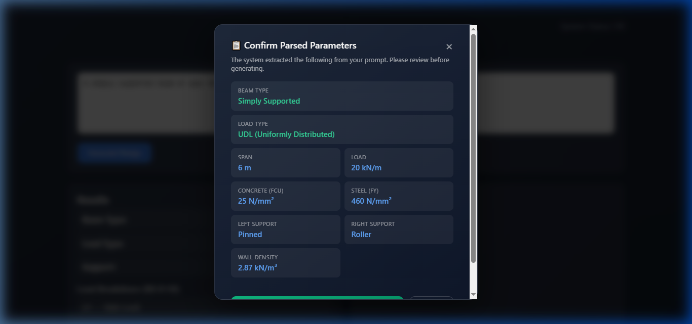
    </a>
     
    <em>Figure 4.14a: Prompt confirmation modal showing parsed parameters for a simply supported beam</em>

    <a href="images/modal_continuous.png">
        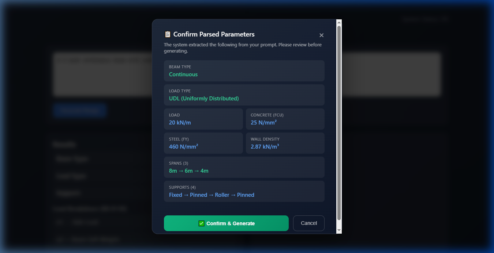
    </a>
     
    <em>Figure 4.14b: Prompt confirmation modal showing parsed parameters for a 3-span continuous beam with mixed support types (Fixed → Pinned → Roller → Pinned)</em>

The modal includes a "Confirm & Generate" button and a "Cancel" button, giving the user full control over the design process.

## 4.15 BS 8110 Bending Reinforcement Design

A comprehensive bending reinforcement design module was implemented following the BS 8110 code of practice for structural concrete design. This replaced the previous simplified steel area calculation with a rigorous, step-by-step procedure.

### 4.15.1 Design Procedure

The BS 8110 design procedure for singly reinforced beams follows these steps:

**Step 1: Effective Depth Calculation**

The effective depth is the distance from the compression face of the beam to the centroid of the tension reinforcement:

d = h − cover − link diameter − (bar diameter / 2)

Where:
- h = total beam depth (mm)
- cover = concrete cover to reinforcement (assumed 25mm)
- link = shear link diameter (assumed 8mm)
- bar = main reinforcement diameter (assumed 16mm initially)

**Step 2: Moment of Resistance**

The moment of resistance represents the maximum moment a singly reinforced section can resist:

Mu = 0.156 × fcu × b × d²

Where:
- fcu = concrete cube strength (N/mm²)
- b = beam width (mm)
- d = effective depth (mm)

If the design moment M exceeds Mu, the beam section is inadequate and must be increased.

**Step 3: K Constant**

K = M / (fcu × b × d²)

Note: K must not be greater than 0.156. If K > 0.156, the value 0.156 is used (singly reinforced section limit).

**Step 4: Lever Arm (z)**

z = d × [0.5 + √(0.25 − K/0.9)]

Note: z must not be greater than 0.95d. If z > 0.95d, the value 0.95d is used.

**Step 5: Required Area of Steel (As)**

As = M / (0.95 × fy × z)

Where:
- M = design moment (Nmm)
- fy = steel yield strength (N/mm²)
- z = lever arm (mm)

### 4.15.2 Implementation in the System

The design module (`design_bending_reinforcement` function) was implemented in `rules/beam_design.py` and accepts the following parameters:
- Design moment (kNm)
- Beam width and depth (mm)
- Concrete strength fcu (N/mm²)
- Steel yield strength fy (N/mm²)

The function returns the complete design breakdown including Mu, K, z, As required, and a section adequacy check.

    <a href="images/bs8110_design_simple.png">
        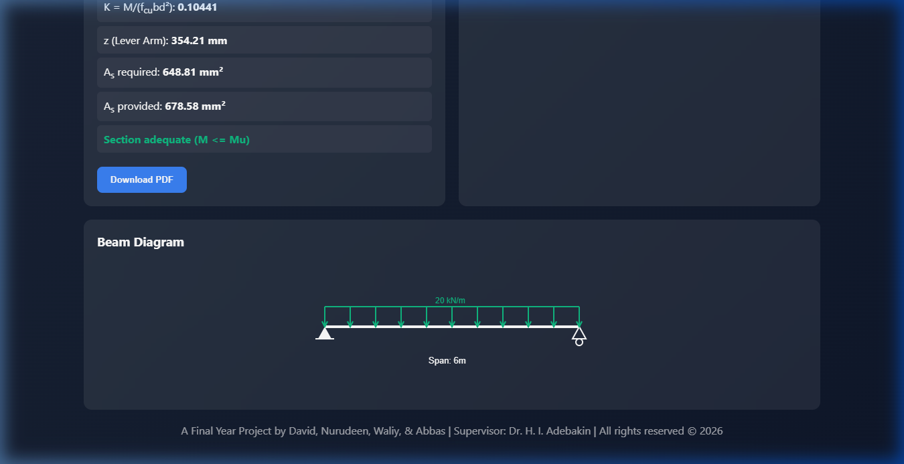
    </a>
     
    <em>Figure 4.15a: BS 8110 bending design results displayed on the frontend, showing Mu, d, K, z, As required, As provided, and section adequacy status</em>

    <a href="images/bs8110_as_beam_diagram.png">
        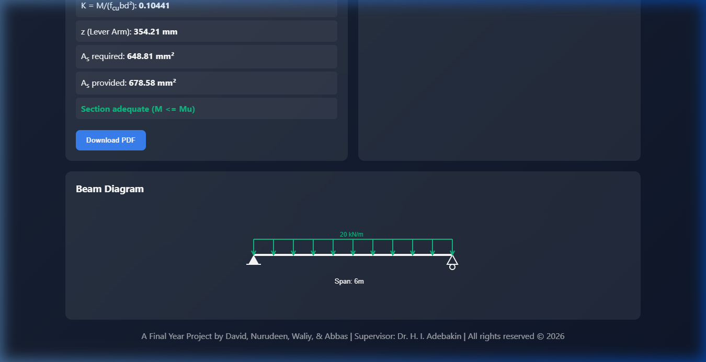
    </a>
     
    <em>Figure 4.15b: BS 8110 design output showing K value, lever arm z, As required and provided, along with the beam diagram for a simply supported beam</em>

## 4.16 Automatic Beam Size Estimation and Resizing

### 4.16.1 Standard Size Progressions

The system estimates beam sizes using standard width and depth progressions commonly used in practice:

**Width progression:** 230mm → 300mm → 450mm → 600mm → 750mm → 900mm
(First increase +70mm, then consistent +150mm)

**Depth progression:** 300mm → 450mm → 600mm → 750mm → 900mm → 1050mm → 1200mm
(Consistent increase of 150mm)

The minimum beam size is 230mm × 300mm.

### 4.16.2 Initial Size Selection

The initial beam size is selected based on the span-to-depth ratio deflection limits from BS 8110:

| Beam Type | Span/Depth Ratio Limit |
|---|---|
| Simply Supported | 20 |
| Cantilever | 7 |
| Continuous | 26 |
| Overhang | 20 |

The minimum depth is calculated as dmin = Span × 1000 / Limit.

### 4.16.3 Automatic Resizing

If the design moment exceeds the moment of resistance (M > Mu), the system automatically increases the beam section through the standard progressions until an adequate section is found. The resized beam is flagged in the output with a "(RESIZED)" label.

When a beam is resized, the system recalculates the beam self-weight and re-runs the entire design with the updated loads, ensuring consistency.

## 4.17 Factored Load Calculations (BS 8110)

The loading system follows BS 8110 partial safety factors:

**Design Load: n = 1.4Gk + 1.6Qk**

Where:
- 1.4 = partial safety factor for dead/permanent loads (γG)
- 1.6 = partial safety factor for live/imposed loads (γQ)

The system calculates four load components:

**n1 — Slab Loading:** Provided by the user as UDL (kN/m)

**n2 — Beam Self-Weight:**
n2 = 1.4 × (width × depth × 24)
For example, a 230×300mm beam: 1.4 × (0.23 × 0.3 × 24) = 2.318 kN/m

**n3 — Wall Loading:**
n3 = 1.4 × (density × thickness × height)
For example, a 230mm wall of 2m height: 1.4 × (2.87 × 0.23 × 2) = 1.849 kN/m

**p1 — Point Load:** Calculated separately as it cannot be added to UDL

**w — Total UDL:** w = n1 + n2 + n3

    <a href="images/results_simple_beam.png">
        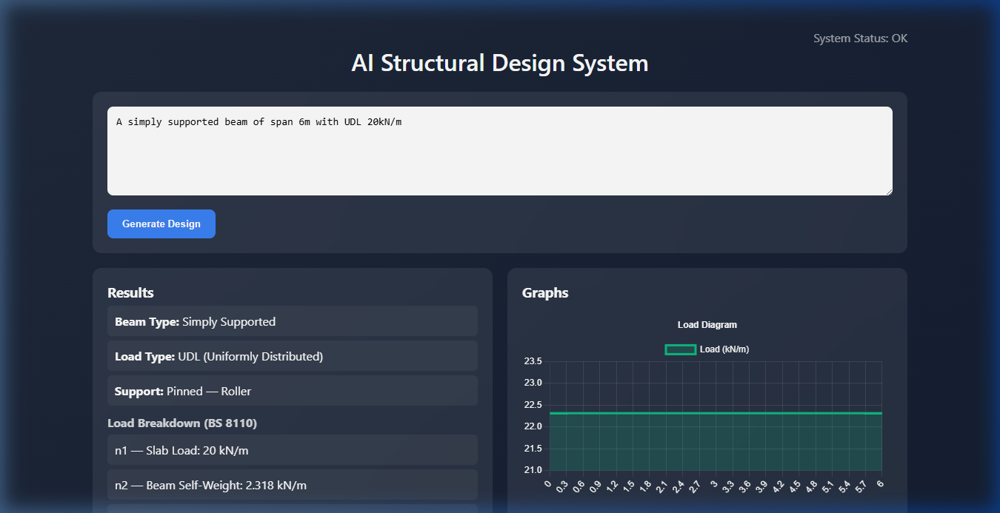
    </a>
     
    <em>Figure 4.17a: System output showing the complete load breakdown (n1, n2, n3, w, p1) for a simply supported beam under BS 8110</em>

## 4.18 Continuous Beam Analysis — Three-Moment Theorem

### 4.18.1 Background

For statically indeterminate structures such as continuous beams, the internal forces cannot be determined by equilibrium equations alone. The Three-Moment Theorem (Clapeyron's Theorem) was implemented as the analytical method for solving continuous beams with any number of spans.

### 4.18.2 Theoretical Basis

The Three-Moment Theorem relates the bending moments at three consecutive supports. For spans i and i+1 with lengths Li and Li+1:

Mi-1·Li + 2·Mi·(Li + Li+1) + Mi+1·Li+1 = −(6·Ai·āi/Li + 6·Ai+1·b̄i+1/Li+1)

Where:
- Mi-1, Mi, Mi+1 = moments at supports i-1, i, i+1
- Li, Li+1 = span lengths
- Ai = area of free bending moment diagram for span i
- āi, b̄i = centroid distances from left and right supports

### 4.18.3 Loading Terms

For a uniformly distributed load (UDL) w on a span of length L:
6Aā/L = 6Ab̄/L = wL³/4

For a point load P at distance a from the left support:
6Aā/L = Pa(L² − a²)/L
6Ab̄/L = Pb·a(2L − a)/L

### 4.18.4 Support Conditions

The solver supports three types of boundary conditions:

| Support Type | Condition | Symbol |
|---|---|---|
| Pinned | M = 0 at support | Triangle (▲) |
| Roller | M = 0 at support | Triangle on circle (▲○) |
| Fixed | M ≠ 0, solved via compatibility | Wall with hatching |

For fixed ends, additional equations are added to the system using the cantilever boundary condition: the fictitious span beyond the fixed end has zero length, generating an extra equation that determines the fixed-end moment.

### 4.18.5 Solution Process

1. Identify which support moments are unknowns (fixed ends) vs known zeros (pinned/roller)
2. Build a system of linear equations from the Three-Moment equations
3. Solve using matrix algebra (numpy linear solver)
4. Compute reactions using per-span equilibrium
5. Generate shear force and bending moment diagrams for each span

The solver is implemented in `rules/continuous_beam.py` using the `solve_three_moment()` function.

    <a href="images/continuous_analysis.png">
        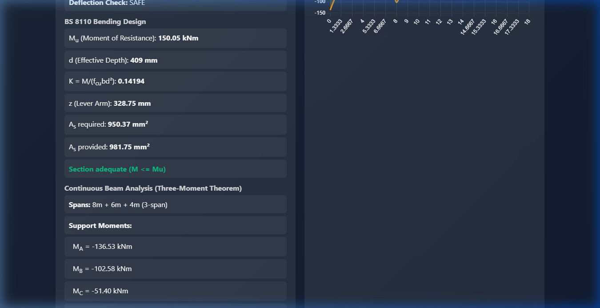
    </a>
     
    <em>Figure 4.18a: Continuous beam analysis results showing support moments (MA through MD) and support reactions (RA through RD) computed using the Three-Moment Theorem</em>

## 4.19 Per-Location Reinforcement Design for Continuous Beams

### 4.19.1 Design Philosophy

Unlike simply supported beams where there is typically a single critical section, continuous beams have multiple critical sections:

- **At supports (hogging moments):** The beam experiences negative (hogging) bending moments at interior supports, requiring top steel reinforcement.
- **At mid-spans (sagging moments):** The beam experiences positive (sagging) bending moments within each span, requiring bottom steel reinforcement.

Each of these locations must be individually designed to determine the required area of steel.

### 4.19.2 Implementation

The system performs the BS 8110 design procedure (K → z → As) at every critical location:

**Support Design (Hogging):**
- Uses the support moment from the Three-Moment solution
- Designs top reinforcement at each interior support
- Supports with M = 0 (pinned/roller at beam ends) require no reinforcement

**Span Design (Sagging):**
- Extracts the maximum positive (sagging) moment from the moment diagram within each span
- Designs bottom reinforcement for each span

The governing (largest As) determines the overall reinforcement recommendation.

### 4.19.3 Reinforcement Design Table

The frontend displays a color-coded table showing the design at each location:

- **Red rows** = hogging moments at supports (top steel)
- **Green rows** = sagging moments at mid-spans (bottom steel)

Each row shows: Location, Type, M (kNm), K, z (mm), As required (mm²), and Reinforcement selection.

    <a href="images/reinf_table.png">
        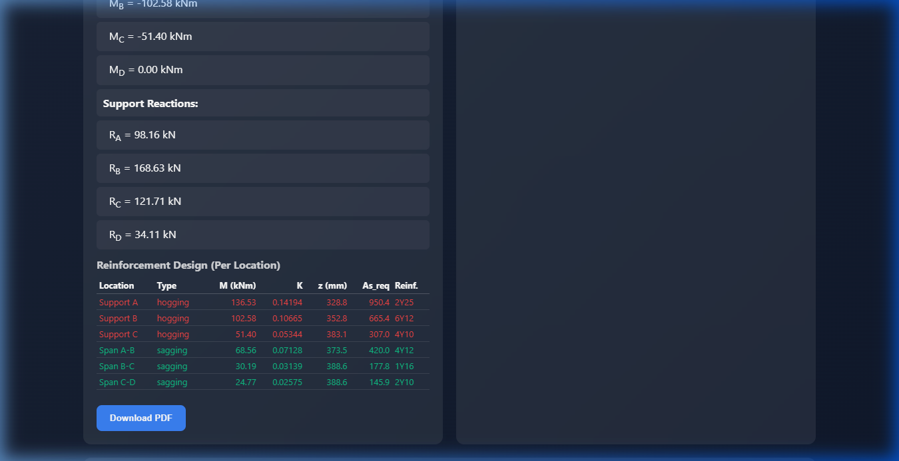
    </a>
     
    <em>Figure 4.19a: Per-location reinforcement design table for a 3-span continuous beam, showing hogging reinforcement at supports (red) and sagging reinforcement at spans (green), with K, z, As calculations for each location</em>

### 4.19.4 Deflection Check

For continuous beams, the deflection check uses the span with the largest sagging moment (the critical span). The span-to-depth ratio for continuous beams is limited to 26 as per BS 8110.

## 4.20 Support Type Visualization

### 4.20.1 Standard Engineering Symbols

The beam diagram visualization was enhanced to display three distinct support types using standard structural engineering symbols:

| Support Type | Symbol Description | Color |
|---|---|---|
| **Fixed** | Vertical wall with diagonal hatching lines | Red (#ef4444) |
| **Pinned** | Inverted triangle with ground line and hatching | Green (#10b981) |
| **Roller** | Inverted triangle resting on a circle with ground line | Amber (#f59e0b) |

These symbols follow conventional structural engineering drawing conventions and are rendered using HTML5 Canvas.

### 4.20.2 Multi-Span Beam Diagram

For continuous beams, the diagram includes:
- Beam line spanning across all supports
- Support symbols at each support location with labels (A, B, C, D...)
- Span length labels between supports
- Support moment values displayed above each support

    <a href="images/beam_diagram_continuous.png">
        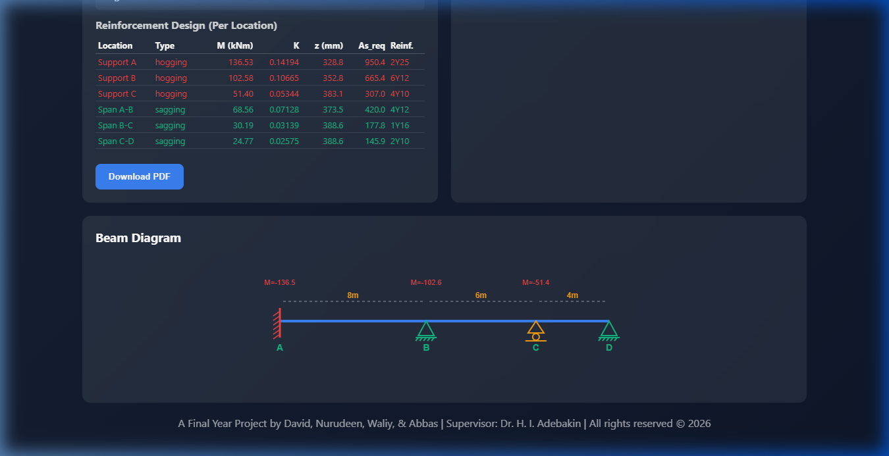
    </a>
     
    <em>Figure 4.20a: Multi-span continuous beam diagram showing fixed support at A (red), pinned at B and D (green), and roller at C (amber), with span lengths and support moments labeled</em>

    <a href="images/beam_diagram_simple.png">
        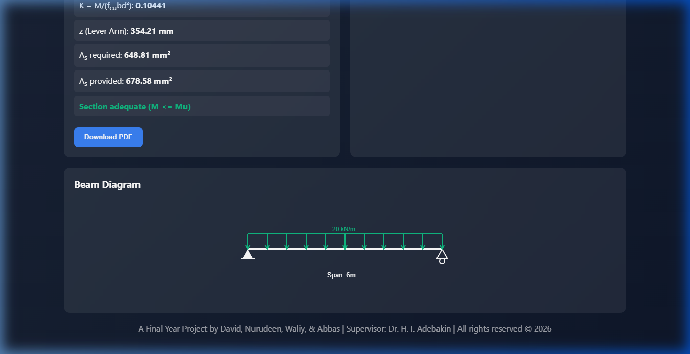
    </a>
     
    <em>Figure 4.20b: Simply supported beam diagram showing pinned (left) and roller (right) supports with UDL representation</em>

## 4.21 Graphical Visualization of Structural Behavior

### 4.21.1 Diagrams Generated

The system generates three diagrams for every beam analysis:

1. **Load Diagram:** Shows the distribution of applied loads along the beam span
2. **Shear Force Diagram (SFD):** Shows how the internal shear force varies along the beam
3. **Bending Moment Diagram (BMD):** Shows how the internal bending moment varies along the beam

For continuous beams, these diagrams are stitched together from per-span data to create a single continuous visualization across all spans.

### 4.21.2 Peak Value Annotation

The bending moment diagram automatically identifies and annotates the peak moment location, showing both the moment value and its position along the beam.

    <a href="images/graphs_simple_beam.png">
        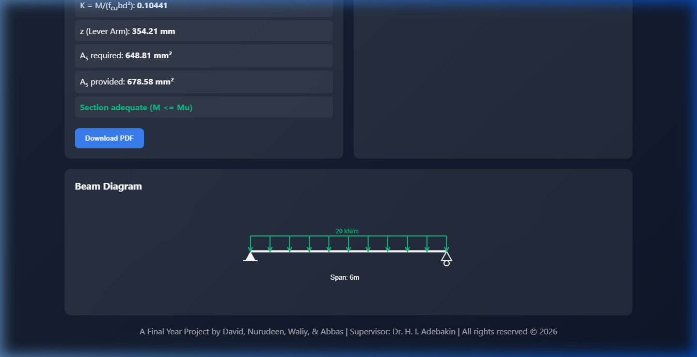
    </a>
     
    <em>Figure 4.21a: Shear Force and Bending Moment diagrams for a simply supported beam under UDL, with peak moment annotation</em>

    <a href="images/graphs_continuous.png">
        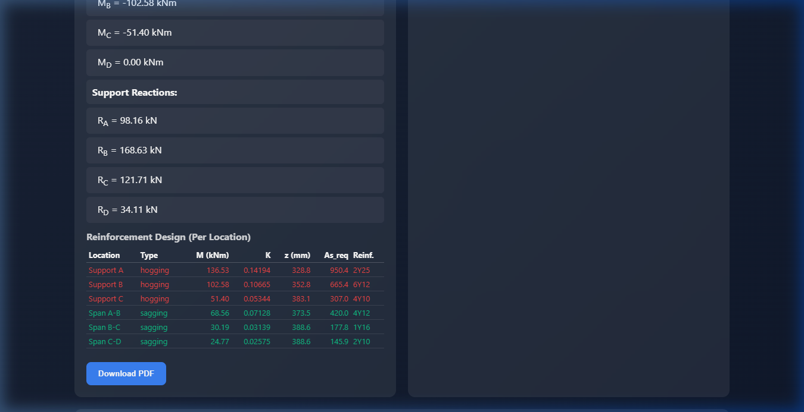
    </a>
     
    <em>Figure 4.21b: Shear Force and Bending Moment diagrams for a 3-span continuous beam, showing the variation of forces across all spans</em>

## 4.22 System Architecture Summary

### 4.22.1 Module Structure

The complete system consists of the following modules:

| Module | File | Purpose |
|---|---|---|
| NLP Parser | `nlp/prompt_parser.py` | Extracts structural parameters from natural language input |
| Beam Design | `rules/beam_design.py` | BS 8110 design calculations, load factors, reinforcement |
| Continuous Beam | `rules/continuous_beam.py` | Three-Moment Theorem solver for multi-span beams |
| API | `api/main.py` | FastAPI backend routing, integration of all modules |
| Report | `api/report.py` | PDF report generation |
| Frontend | `api/static/` | HTML, CSS, JavaScript user interface |
| AI Model | `model.pkl` | Machine learning model for steel area prediction |

### 4.22.2 Data Flow

The system operates through the following data flow:

1. **User Input** → Natural language prompt entered in the frontend
2. **Parsing** → `prompt_parser.py` extracts span, load, beam type, support types
3. **Confirmation** → Modal displays parsed parameters for user review
4. **API Routing** → `main.py` routes to appropriate solver (single-span or continuous)
5. **BS 8110 Design** → Factored loads → Design moments → K → z → As
6. **Reinforcement** → Area of steel → Bar selection (diameter & number)
7. **Diagrams** → SFD, BMD, Load diagrams generated
8. **Frontend Display** → Results, design breakdown, diagrams, and beam visualization

### 4.22.3 Supported Beam Types

| Beam Type | Analysis Method | Key Features |
|---|---|---|
| Simply Supported | Static equilibrium | UDL and point loads |
| Cantilever | Static equilibrium | Fixed end, free end |
| Overhang | Static equilibrium | Extension beyond support |
| Continuous (2+ spans) | Three-Moment Theorem | Any number of spans, mixed supports |

### 4.22.4 Supported Support Types

| Type | Structural Behavior | Moment Condition |
|---|---|---|
| Pinned | Allows rotation, prevents translation | M = 0 |
| Roller | Allows rotation and horizontal translation | M = 0 |
| Fixed | Prevents rotation and translation | M ≠ 0 (solved) |

### 4.22.5 Test Validation Results

The system was validated using three test cases:

**Test 1: Simply Supported Beam (6m span, 20 kN/m UDL)**
- Beam size: 230mm × 450mm (resized from 300mm depth)
- M = 100.43 kNm, Mu = 150.05 kNm (adequate)
- K = 0.10441, z = 354.21 mm
- As required = 648.81 mm², Provided = 678.58 mm² (6Y12)
- Deflection: SAFE

**Test 2: 3-Span Continuous Beam (8m + 6m + 4m, 20 kN/m UDL)**
- Supports: Fixed → Pinned → Roller → Pinned
- Governing moment: 136.53 kNm at Support A (hogging)
- K = 0.14194, z = 328.75 mm
- As required = 950.37 mm², Provided = 981.75 mm² (2Y25)
- Per-location design: 6 critical sections designed individually

**Test 3: 2-Span Continuous Beam (6m + 5m, 15 kN/m UDL, fixed both ends)**
- Beam size: 230mm × 300mm
- Mu = 60.17 kNm (adequate)
- All support and span reinforcement designed individually

All test results verified equilibrium (ΣReactions = Total Applied Load) and section adequacy checks.

