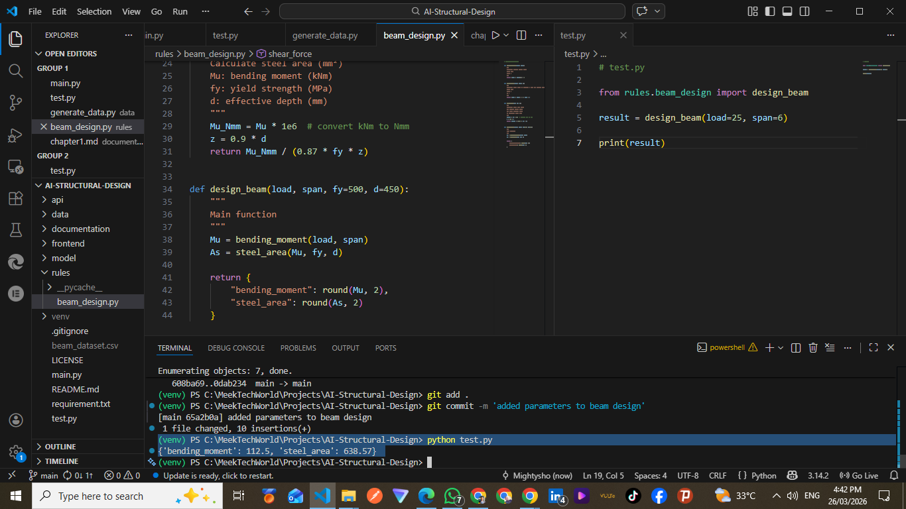
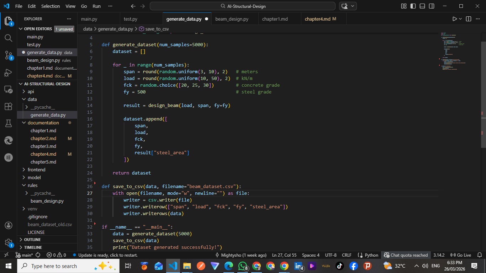
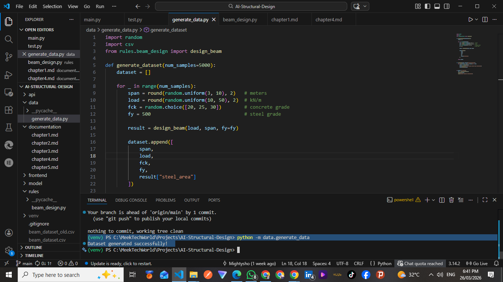
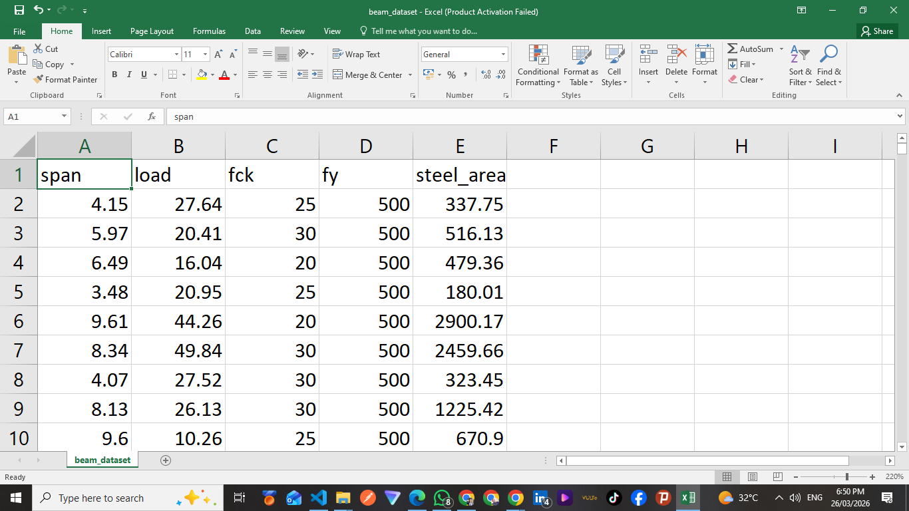
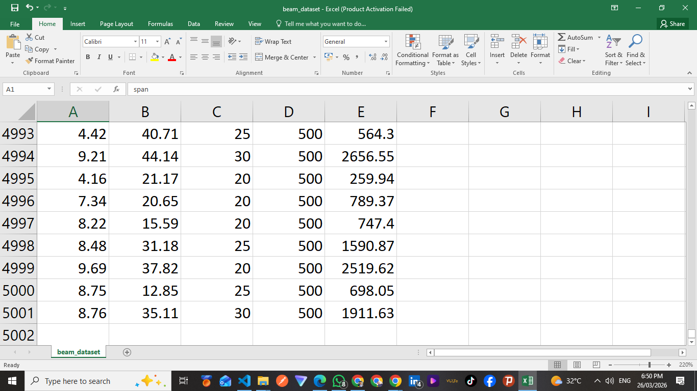

# Chapter Four - Implementation & Results

## 4.1 Beam Design Implementation

The beam design module was developed using Python functions to compute structural parameters.

    

<!--  -->
 
The bending moment for a simply supported beam under uniformly distributed load was calculated using the formula:

Mu = wL² / 8

Where:

- w = load (kN/m)
- L = span (m)

The required steel area was computed using standard reinforcement concrete design equations.

## 4.2 Dataset Generation

A dataset was generated using simulated structural parameters to train the AI model.

    

<!--  -->

    

<!--  -->

The parameters included:

- Beam span (3m – 10m)
- Load (10 kN/m – 50 kN/m)
- fck (concrete grade 20 - 30)
- fy (steel grade 500)

For each generated input, the corresponding steel area was calculated using the standard beam design equations.

A total of 5000 data samples were generated and stored in a CSV file for training purposes.

    

<!--  -->

    

<!--  -->
