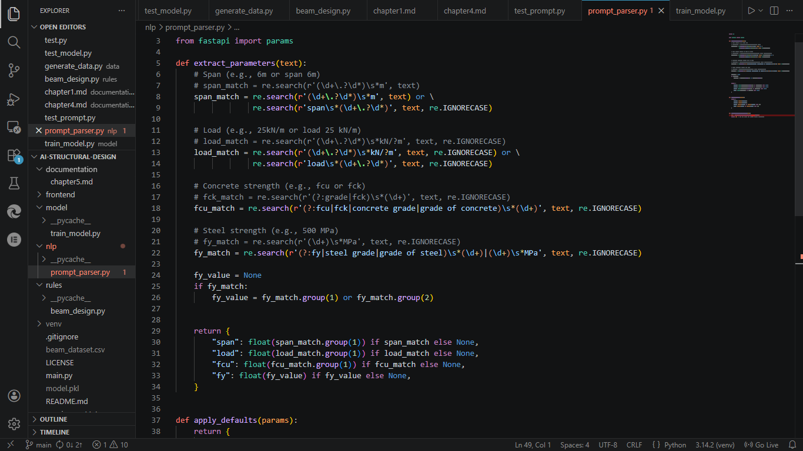
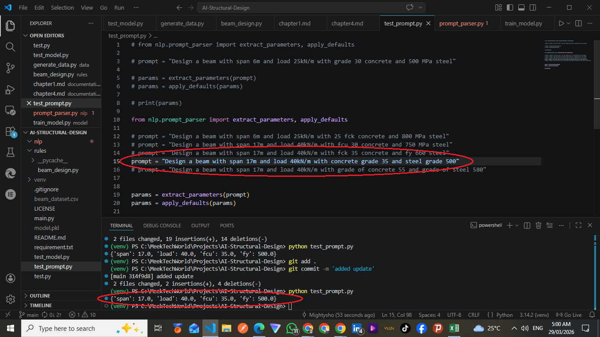
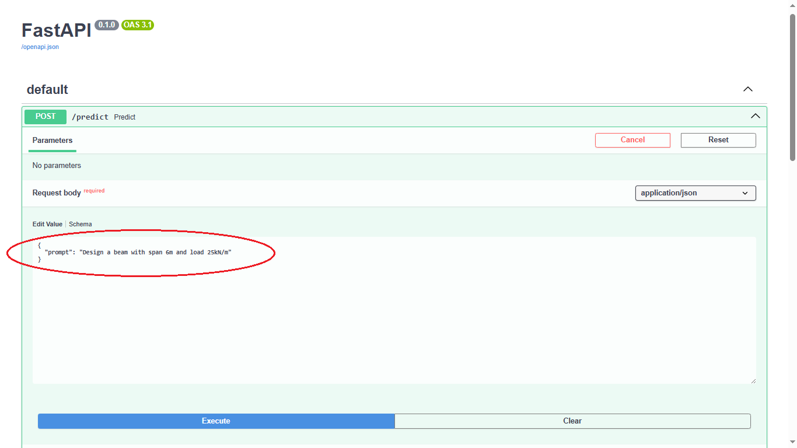
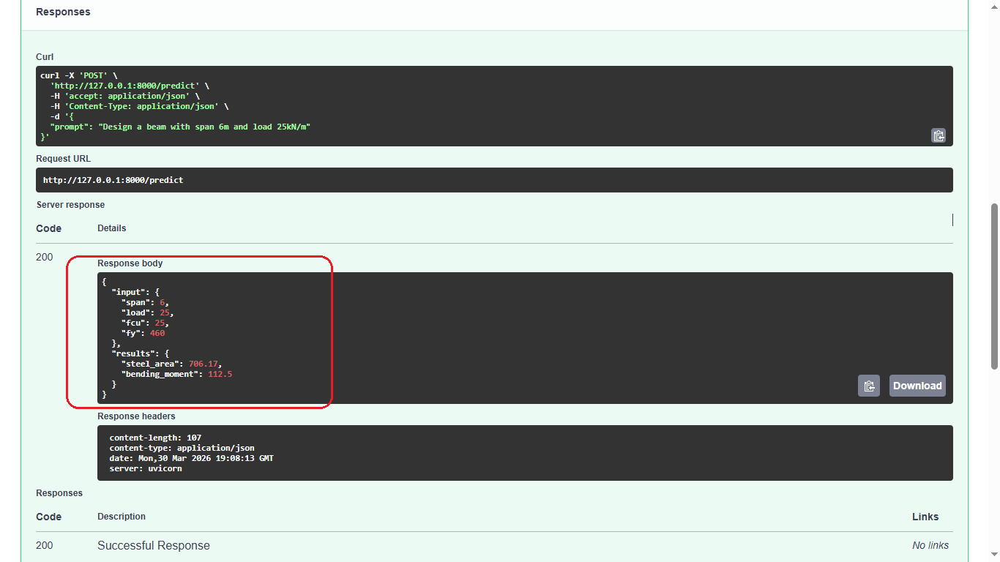
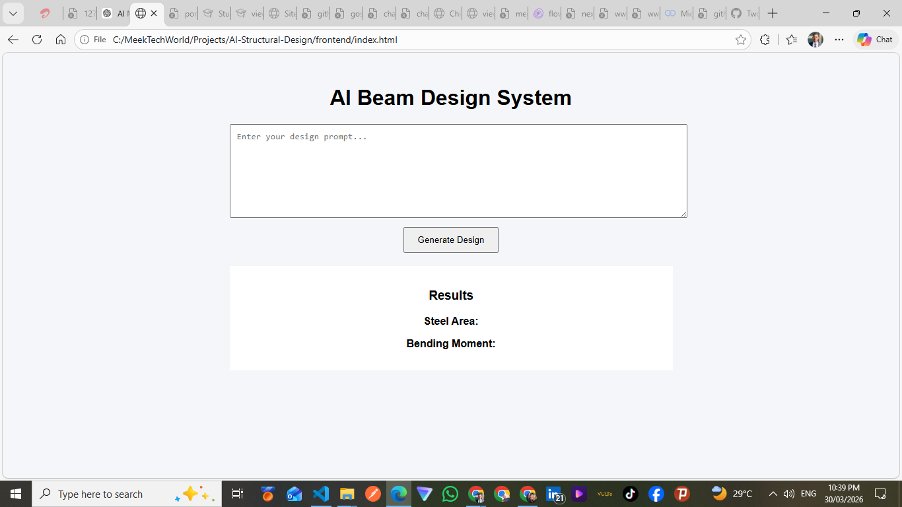

# Chapter Four - Implementation & Results

## 4.1 Beam Design Implementation

The beam design module was developed using Python functions to compute structural parameters.

    
     
    <em>Figure 4.1a: Beam design testing result</em>

<!--  -->
 
The bending moment for a simply supported beam under uniformly distributed load was calculated using the formula:

Mu = wL² / 8

Where:

- w = load (kN/m)
- L = span (m)

The required steel area was computed using standard reinforcement concrete design equations.

    
     
    <em>Figure 4.1b: Beam design testing code</em>

## 4.2 Dataset Generation

A dataset was generated using simulated structural parameters to train the AI model.

    
         
        <em>Figure 4.2a: Dataset generation script</em>

    
     
    <em>Figure 4.2b: Dataset generation terminal print</em>

The parameters included:

- Beam span (3m – 10m)
- Load (10 kN/m – 50 kN/m)
- fck (concrete grade 20, 25, 30)
- fy (steel grade 460)

For each generated input, the corresponding steel area was calculated using the standard beam design equations.

A total of 5000 data samples were generated and stored in a CSV file for training purposes.

    
    
     
    <em>Figure 4.2c & 4.2d: Generated data samples in csv</em>

## 4.3 AI Model Development

A machine learning model was developed to predict the required steel area for beam design based on input parameters.

    
     
    <em>Figure 4.3a: AI model development script</em>

The dataset generated was used to train the model, with the following features:

- Span
- Load
- fck
- fy

The target output was:

- Steel area

A Random Forest Regression algorithm was used for training due to its ability to handle nonlinear relationships and provide accurate predictions.

    
     
    <em>Figure 4.3b: trained AI model</em>

The trained model was saved as "model.pkl" and used for making predictions within the system.

The result output from the model was compared with the calculated steel area from the beam design module to evaluate the accuracy of predictions.

    
     
    <em>Figure 4.3c: AI generated Steel Area result</em>

## 4.4 Model Input Features

The AI model was trained using four input features:

- Span
- Load
- Concrete strength/grade (fcu/fck)
- Steel strength/grade (fy)

These parameters were used to improve the accuracy of predictions and better reflect real-world structural design conditions.

The inclusion of both concrete and steel grades allowed the model to learn the influence of material properties on the required steel area for beam design.

    
     
    <em>Figure 4.4a: Model input features</em>

## 4.5 Prompt-Based Input System

A prompt-based input system was developed to allow users to input structural parameters using natural language.

The system extracts key parameters such as:

- Span
- Load
- Concrete strength/grade (fcu/fck)
- Steel strength/grade (fy)

    
     
    <em>Figure 4.5a: Natural language parameters extracter</em>

    
     
    <em>Figure 4.5b: Prompt to parameters testing</em>

Pattern matching techniques using regular expressions were used to identify and extract values from user input.

Default values were applied for missing parameters to ensure reliable system performance.

## 4.6 System Integration and API Development

A backend API was developed to integrate the AI model, engineering calculations, and prompt-based input system.

The API was implemented using FastAPI and allows users to send input data either manually or as a natural language prompt.

    
    
     
    <em>Figure 4.6a & 4.6b: Testing the API using natural language prompts</em>

The system processes the input, performs AI-based prediction, computes structural parameters, and returns the results in a structured format.

## 4.7 Flexible Prompt Interpretation     *

The system was enhanced to support flexible natural language input by allowing multiple representations of structural parameters.

For example:

Concrete strength can be entered as “fcu”, “fck”, “concrete grade”, or “grade of concrete”
Steel strength can be entered as “fy”, “steel grade”, or “grade of steel”

The system also supports different positional formats such as:

“6m span”
“span 6m”

This improves usability and allows the system to better interpret human language inputs.

    
     
    <em>Figure 4.7a: Flexible Prompt Interpretation</em>

## 4.8 Enhanced API Integration      *

The API was enhanced to support flexible user input by integrating an improved prompt parsing system.

The system allows different representations of structural parameters such as:

“fcu”, “fck”, and “concrete grade” for concrete strength
“fy”, “steel grade”, and “MPa” for steel strength

To maintain compatibility with the trained AI model, the extracted concrete strength (fcu) was internally mapped to fck before prediction.

This approach ensures both flexibility in user input and consistency in model performance.

## 4.9 Frontend Development

A user interface was developed using HTML, CSS, and JavaScript to allow interaction with the system.

The interface allows users to input design prompts and view computed structural results.

The frontend communicates with the backend API using HTTP requests and displays the results dynamically.

    
     
    <em>Figure 4.9a: Frontend interface</em>

