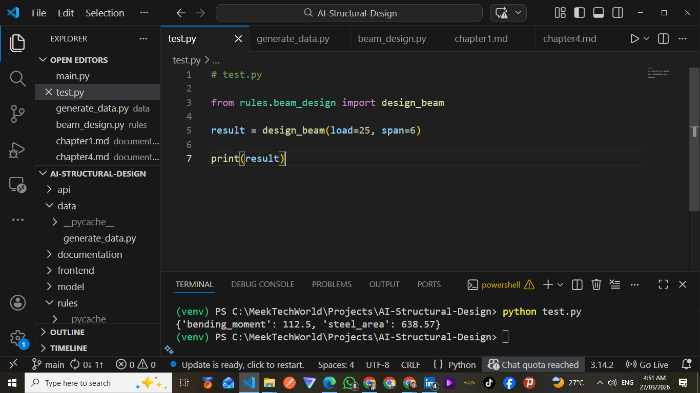
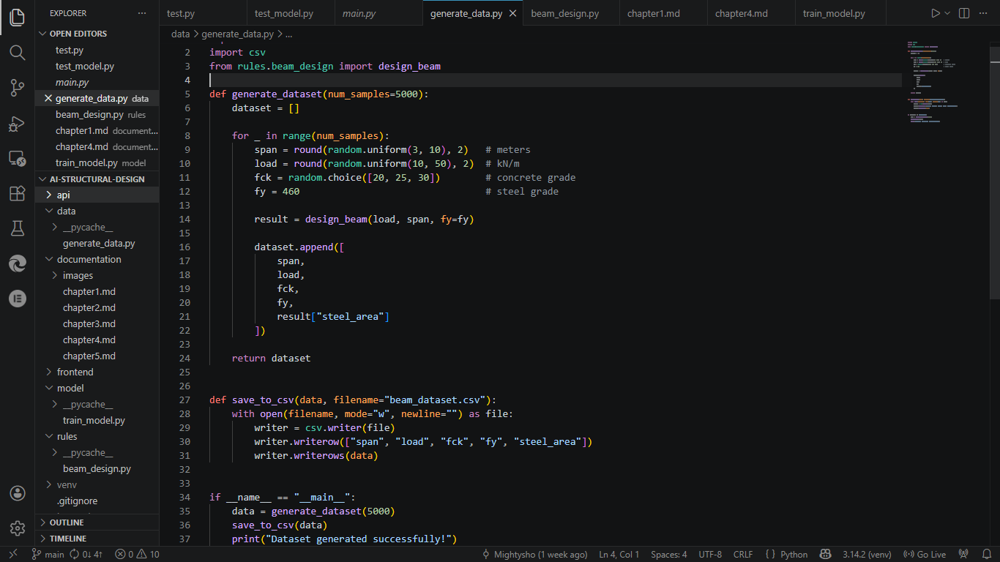
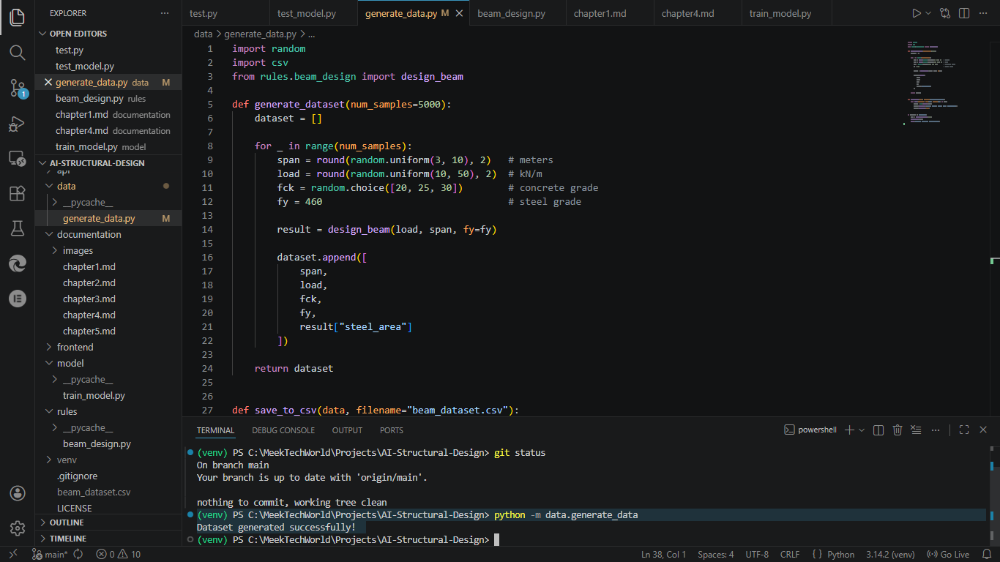
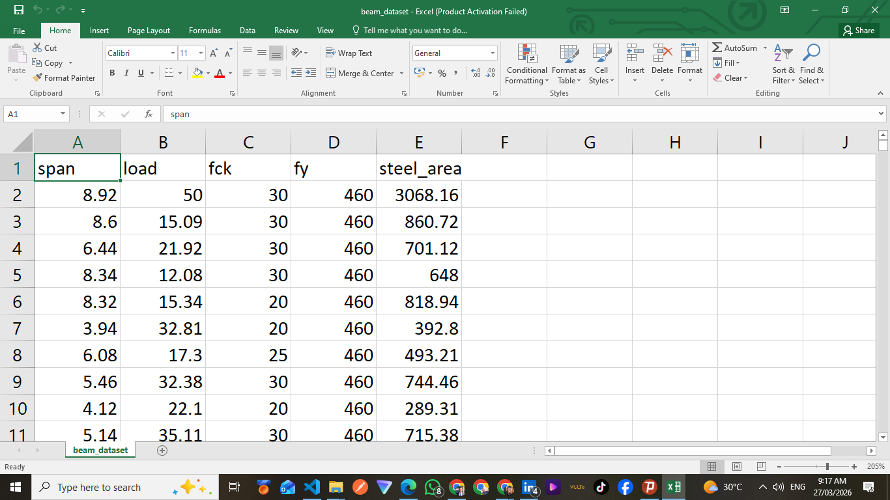
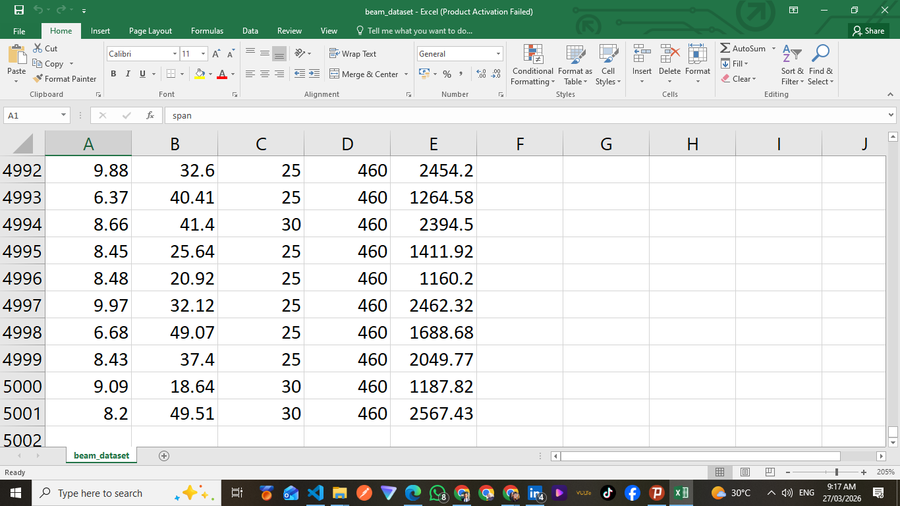
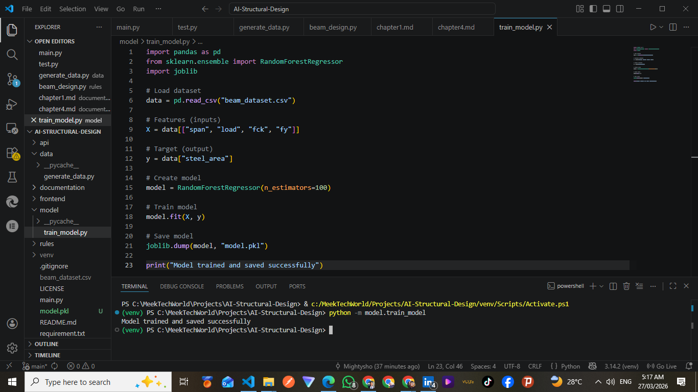
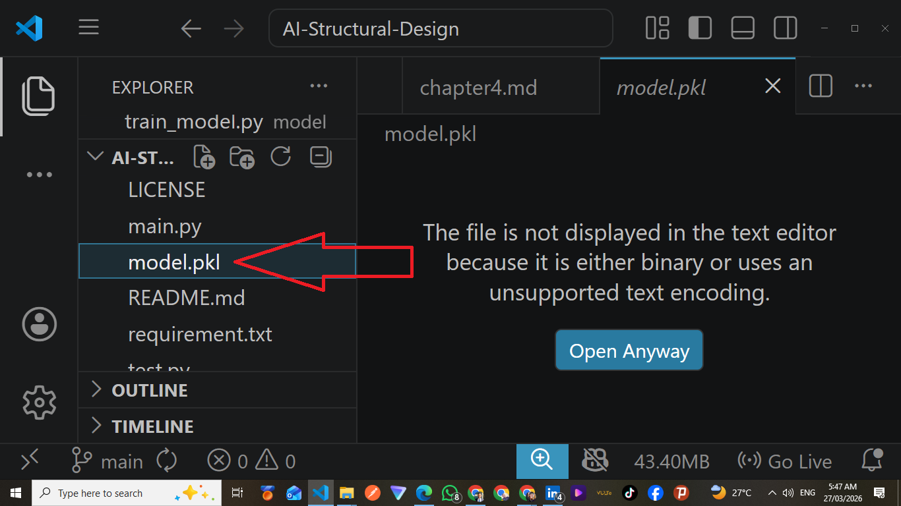
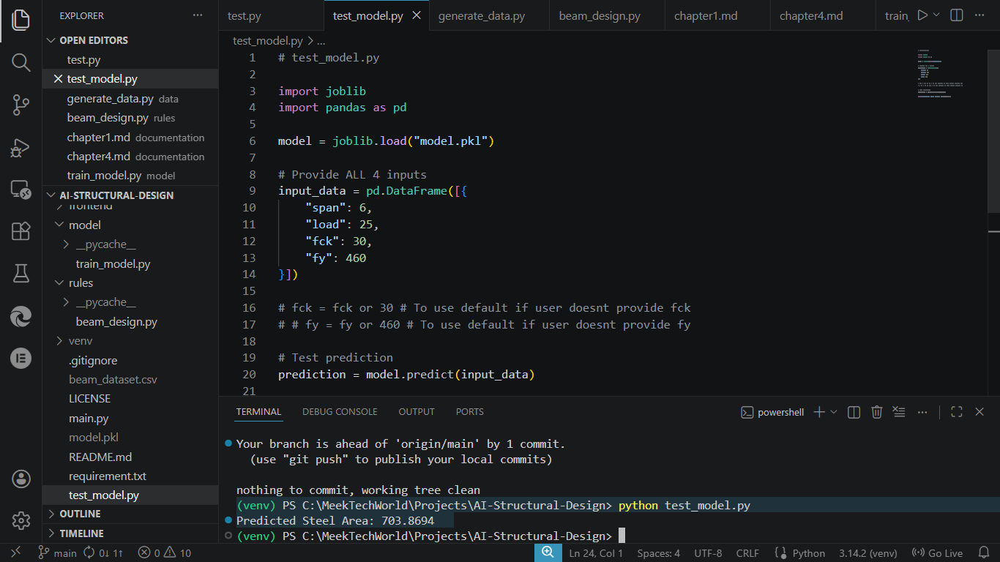
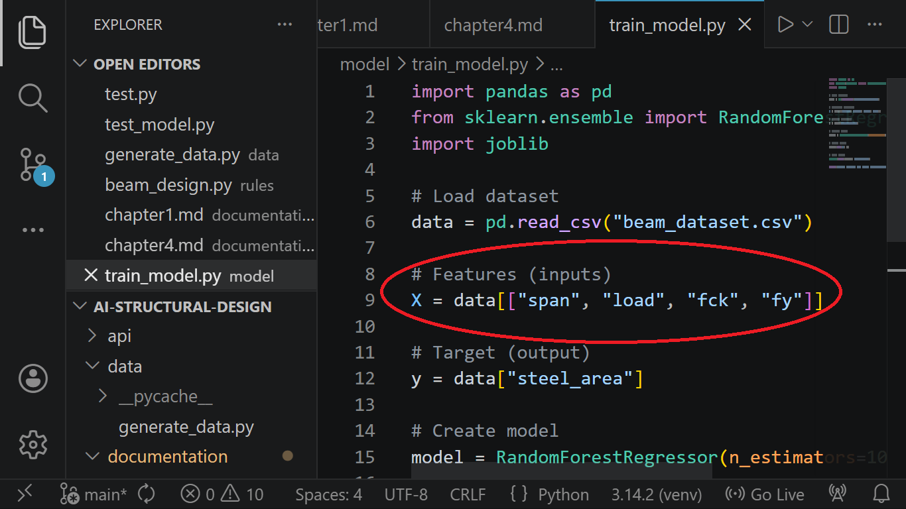

# Chapter Four - Implementation & Results

## 4.1 Beam Design Implementation

The beam design module was developed using Python functions to compute structural parameters.

    
     
    <em>Figure 4.1a: Beam design testing result</em>

<!--  -->
 
The bending moment for a simply supported beam under uniformly distributed load was calculated using the formula:

Mu = wL² / 8

Where:

- w = load (kN/m)
- L = span (m)

The required steel area was computed using standard reinforcement concrete design equations.

    
     
    <em>Figure 4.1b: Beam design testing code</em>

## 4.2 Dataset Generation

A dataset was generated using simulated structural parameters to train the AI model.

    
         
        <em>Figure 4.2a: Dataset generation script</em>

    
     
    <em>Figure 4.2b: Dataset generation terminal print</em>

The parameters included:

- Beam span (3m – 10m)
- Load (10 kN/m – 50 kN/m)
- fck (concrete grade 20, 25, 30)
- fy (steel grade 460)

For each generated input, the corresponding steel area was calculated using the standard beam design equations.

A total of 5000 data samples were generated and stored in a CSV file for training purposes.

    

        
         
        <em>Figure 4.2c: Generated data samples in csv</em>
    

    

        
         
        <em>Figure 4.2d: Generated data samples in csv</em>
    

## 4.3 AI Model Development

A machine learning model was developed to predict the required steel area for beam design based on input parameters.

    
     
    <em>Figure 4.3a: AI model development script</em>

The dataset generated was used to train the model, with the following features:

- Span
- Load
- fck
- fy

The target output was:

- Steel area

A Random Forest Regression algorithm was used for training due to its ability to handle nonlinear relationships and provide accurate predictions.

    
     
    <em>Figure 4.3b: trained AI model</em>

The trained model was saved as "model.pkl" and used for making predictions within the system.

The result output from the model was compared with the calculated steel area from the beam design module to evaluate the accuracy of predictions.

    
     
    <em>Figure 4.3c: AI generated Steel Area result</em>

## 4.4 Model Input Features

The AI model was trained using four input features:

- Span
- Load
- Concrete strength/grade (fck)
- Steel strength/grade (fy)

These parameters were used to improve the accuracy of predictions and better reflect real-world structural design conditions.

The inclusion of both concrete and steel grades allowed the model to learn the influence of material properties on the required steel area for beam design.

    
     
    <em>Figure 4.4a: Model input features</em>

