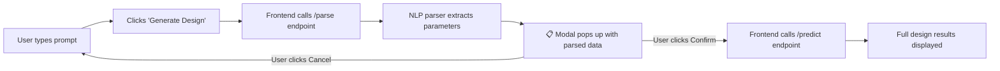

# Parse Modal — How It Works

## ✅ Implementation Status: **COMPLETE**

All files are in place and the full two-step flow is working:

| File | Status | What was added |
|---|---|---|
| `api/main.py` | ✅ | `/parse` endpoint |
| `api/static/index.html` | ✅ | Modal HTML structure |
| `api/static/style.css` | ✅ | Modal overlay & animation CSS |
| `api/static/script.js` | ✅ | `handleGenerate()`, `showModal()`, `confirmGenerate()` |

---

## 🔄 How the Parse Modal Works

The modal adds a **verification step** between writing the prompt and running the full design:

### Step-by-Step Flow

1. **User writes a prompt** in the textarea (e.g., *"a beam AB of span 6m with overhang BC of 2m, point load of 10KN at free end C"*)

2. **Clicks "Generate Design"** → calls `handleGenerate()` in JS

3. **Frontend sends prompt to `/parse`** — this lightweight endpoint only runs the NLP parser (`extract_parameters` + `apply_defaults`), **no calculations are done yet**

4. **Modal pops up** — a centered overlay with blurred dark backdrop shows all the extracted parameters in a clean 2-column grid

5. **User reviews** — if the parser misunderstood something, they can **Cancel** and rephrase

6. **Clicks "✅ Confirm & Generate"** → the prompt is sent to `/predict` for the full engineering design

7. **Results load** — load breakdown, bending moments, shear forces, diagrams, reinforcement

---

## 📋 Parameters Shown in the Modal

The modal displays **only the parameters that are relevant** (null/zero optional fields are hidden). Here's what can appear:

| Parameter | Label in Modal | Unit | When it shows |
|---|---|---|---|
| `beam_type` | **BEAM TYPE** | — | Always (highlighted green) |
| `load_type` | **LOAD TYPE** | — | Always (highlighted green) |
| `span` | SPAN | m | Always |
| `load` | LOAD | kN/m | Always |
| `slab_load` | SLAB LOAD (n1) | kN/m | Only if slab load mentioned |
| `point_load` | POINT LOAD (p1) | kN | Only if point load mentioned |
| `load_position` | LOAD POSITION | m | Only if position specified |
| `overhang_length` | OVERHANG LENGTH | m | Only for overhang beams |
| `fcu` | CONCRETE (FCU) | N/mm² | Always (default: 25) |
| `fy` | STEEL (FY) | N/mm² | Always (default: 460) |
| `support_left` | LEFT SUPPORT | — | Always (e.g. Pinned) |
| `support_right` | RIGHT SUPPORT | — | Always (e.g. Roller) |
| `wall_height` | WALL HEIGHT | m | Only if wall specified |
| `wall_thickness` | WALL THICKNESS | m | Only if wall specified |
| `density` | WALL DENSITY | kN/m³ | If density found (default: 2.87) |

---

## 📸 Example: What the Modal Shows

### Prompt: *"Design a simply supported beam with span 6m and load 25kN/m"*

The modal will show:
- **Beam Type**: Simply Supported
- **Load Type**: UDL (Uniformly Distributed)
- **Span**: 6 m | **Load**: 25 kN/m
- **Concrete (fcu)**: 25 N/mm² | **Steel (fy)**: 460 N/mm²
- **Left Support**: Pinned | **Right Support**: Roller
- **Wall Density**: 2.87 kN/m³

### Prompt: *"A beam AB of span 6m with overhang BC of 2m, point load of 10KN at free end C"*

The modal will show:
- **Beam Type**: Overhang *(detected from "overhang" keyword)*
- **Load Type**: Point Load *(detected from "point load" keyword)*
- **Span**: 6 m | **Load**: 10 kN/m
- **Point Load (p1)**: 10 kN | **Load Position**: 8 m *(calculated: 6m span + 2m overhang)*
- **Overhang Length**: 2 m
- **Concrete (fcu)**: 25 N/mm² | **Steel (fy)**: 460 N/mm²
- **Left Support**: Pinned | **Right Support**: Roller

### Prompt: *"Design a cantilever beam with span 4m, point load of 30kN at 4m"*

The modal will show:
- **Beam Type**: Cantilever
- **Load Type**: Point Load
- **Span**: 4 m | **Load**: 30 kN/m
- **Point Load (p1)**: 30 kN | **Load Position**: 4 m
- **Concrete (fcu)**: 25 N/mm² | **Steel (fy)**: 460 N/mm²
- **Left Support**: Fixed | **Right Support**: Free

---
